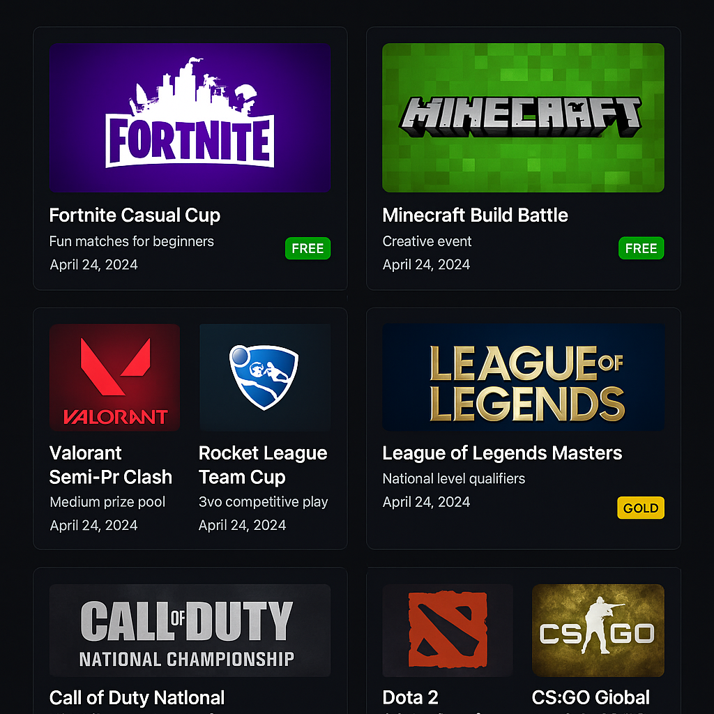

# 🎮 Gaming Tournament App

A responsive web app that shows gaming events based on user tier (Free, Silver, Gold, Platinum). Users can sign in, view allowed events, and simulate tier upgrades.



---

## 🚀 Tech Stack

- **Next.js 14 (App Router)**  
- **Clerk.dev** for Authentication  
- **Supabase (PostgreSQL)** for Event Storage  
- **Tailwind CSS** for Styling  

---

## 🔐 Demo Credentials

Use these demo users to test tier-based filtering:

| Tier      | Email                     | Password     |
|-----------|---------------------------|--------------|
| Free      | `freeuser@example.com`    | `password123`|
| Silver    | `silveruser@example.com`  | `password123`|
| Gold      | `golduser@example.com`    | `password123`|
| Platinum  | `platinumuser@example.com`| `password123`|

> ⚠️ Create these users in [Clerk Dashboard](https://dashboard.clerk.dev) and set `publicMetadata.tier` accordingly.

---

## 📦 Setup Instructions

### 1. Clone the Repo

```bash
git clone https://github.com/your-username/gaming-tournament-app.git
cd gaming-tournament-app
```

### 2. Install Dependencies

```bash
npm install
```

### 3. Configure Environment Variables

Rename `.env.example` to `.env.local` and fill in your keys:

```env
NEXT_PUBLIC_CLERK_PUBLISHABLE_KEY=your_clerk_publishable_key
CLERK_SECRET_KEY=your_clerk_secret_key
NEXT_PUBLIC_SUPABASE_URL=https://yourproject.supabase.co
NEXT_PUBLIC_SUPABASE_ANON_KEY=your_supabase_anon_key
```

### 4. Set Up Supabase

- Open Supabase SQL Editor
- Run the contents of `supabase_setup.sql`

This will:
- Create the `events` table
- Add 8 sample events (2 per tier)
- Configure basic RLS policy

---

### 5. Run the App Locally

```bash
npm run dev
```

Visit [http://localhost:3000](http://localhost:3000)

---

## 🌐 Deployment (Vercel)

1. Push the repo to GitHub
2. Go to [https://vercel.com](https://vercel.com)
3. Import your GitHub repo
4. Add Environment Variables
5. Click Deploy 🚀

---

## ✨ Features

- ✅ Tier-based event visibility (Free ≤ Silver ≤ Gold ≤ Platinum)
- ✅ Simulated tier upgrade button (via Clerk)
- ✅ Blur-locked UI for inaccessible events
- ✅ Clerk metadata integration
- ✅ Responsive Tailwind design
- ✅ RLS setup for Supabase security

---

## 📄 License

MIT — Free to use and modify.
